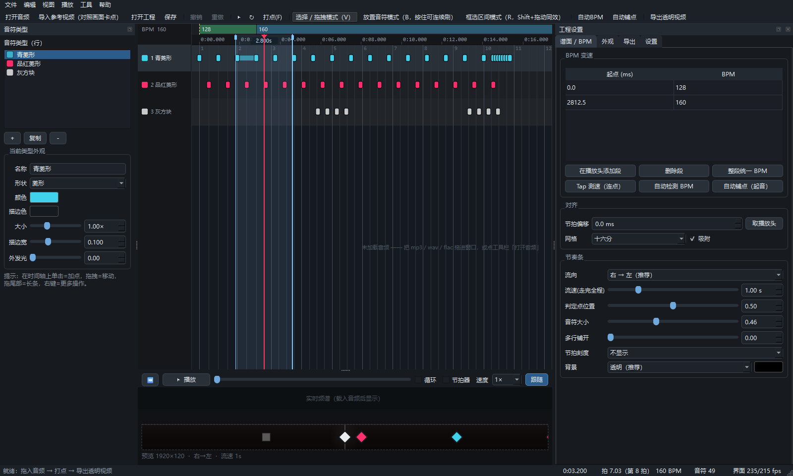

# 节奏条工作室 · RhythmBar Studio

给**视频卡点**用的节奏条（音游打击条）编辑器：中间判定点、音符从两侧扫向判定线、
实时编辑、任意 BPM 变速、导出**背景透明视频**，直接叠到你的视频上。



---

## 30 秒上手

1. 双击 **`启动.bat`**（首次会自动装依赖）
2. 把 视频或音频 拖进窗口
3. 按 **空格** 播放，跟着音乐按 **F** 打点 —— 或者点「自动检测 BPM」+「自动铺点」
4. 在时间轴上微调，右侧面板调外观
5. **Ctrl+E** 导出透明视频，拖进剪辑软件，放在原视频**上层**

没音频也能玩：**文件 → 载入示例工程**。

---

## 核心功能

### 编辑（像音游铺面编辑器）
**三种鼠标模式**，用工具栏按钮 / `V` / `B` / `R` / `Tab` 切换：

| | 选择拖拽（V，默认） | 放置音符（B） | 框选区间（R） |
|---|---|---|---|
| 空白处单击 | 清除选择 | 在当前行加一个音符 | — |
| 空白处拖动 | 框选音符 | **沿网格连续刷音符**（整段一次撤销） | **选出时间区间** |
| 拖音符 | 移动 | 移动 | — |
| 悬停后拖右侧把手 | 拉成长条（hold） | 拉成长条 | — |

**标尺 / 波形 / 频谱 / 胶片条区域**：

* **直接拖动 = 拖播放头**（自由定位，不吸附）——原来的手感
* **Shift + 拖动 = 框选时间区间**（等价于切到 R 模式再拖）
* 区间会高亮显示并标注时长，右键 →「在这个区间填充音符…」/「把区间设为循环区间」/「清除」
* 循环区间在图上会标「循环 x.xxs」；取消方式：取消勾选「循环」、播放菜单 →「清除循环」、
  或右键 →「清除循环区间」

| 其它操作 | 说明 |
|---|---|
| Ctrl+拖动 / Ctrl+A | 加选 / 全选 |
| 右键 | 改类型、量化、删除、长条增减一小节、区间填充/循环、从这一点填充 |
| F | **在播放位置打点**（卡点主力操作） |
| Del / Ctrl+Z / Ctrl+Y | 删除 / 撤销 / 重做 |
| Ctrl+C / Ctrl+V / Ctrl+D | 复制 / 粘贴到播放头 / 向后复制一份 |
| Ctrl+Q / Ctrl+M | 量化到网格 / 镜像选中区间 |
| 数字 1~9 / Q / W | 切换音符类型 / 上下换行 |
| 方向键（Shift 加速，Ctrl 移动选中） | 移动播放头 / 微调选中音符 |
| Ctrl+滚轮 / Shift+滚轮 / 中键拖动 | 缩放 / 平移 / 平移 |
| L / M / S | 设循环 A-B / 节拍器 / 吸附开关 |
| Ctrl+0 | 缩放适应 |

### 判定点（中间那枚菱形）
* **常驻一枚 45° 灰白菱形**，不管有没有音符都在
* 音符打到它的瞬间，**按该音符的颜色闪一下**，同时放大 + 扩散圈，再平滑回灰白
* 可调：菱形颜色 / 大小、染色强度、染色时长、判定窗口、随 BPM 脉冲、命中扩散圈

### BPM 变速
* **BPM 段列表**：任意多个变速段，表格里直接改时间与 BPM；时间轴上拖动段边界即可移动
* **Tap 测速**：连点几下自动算出 BPM
* **自动检测 BPM**：分析音频给建议值 + 节拍偏移（beat 0 的位置）
* **节拍偏移**：波形对不上网格时，一键「取播放头」对齐
* 音符存的是**绝对毫秒**，改 BPM 只影响网格，不会把你对好的音符挪走

### 批量铺点（三种方式）
1. **框选区间 → 填充**（推荐）：Shift+拖动（或切到 R 模式）框出区间 →
   右键「在这个区间填充音符…」，再选间隔（按节拍：每 1/4 拍、每 2 拍… /
   按毫秒：每 125ms…）和类型；两种类型可自动交替，实时显示会生成多少个
2. **自动铺点 · 音频起音**：谱通量起音检测，灵敏度/最小间隔/是否吸附到网格可调，
   先「试检测」看数量再生成
3. **自动铺点 · 视频镜头切换**：按画面硬切自动打点

### 参考视频对照（自带声音也能用）
* **Ctrl+Shift+V**（或文件菜单）导入 mp4/mov/mkv/avi/webm 等参考视频
* **视频里的声音会自动拿来当工作音频** —— 波形、频谱、自动 BPM、起音铺点全都基于它，
  不用再单独找音频文件（已经载入过别的音频时会问你一句要不要换）
* 时间轴从下到上依次是：**音符行 → 视频胶片条 → 频谱图 → 波形**
* 左下角**参考画面**跟随播放头显示；暂停后自动取一帧精确画面（带缓存，拖动不卡）
* 「自动铺点 → 依据：视频镜头切换」可把画面硬切点直接变成音符
* 视频路径随工程保存，下次打开自动恢复

### 频谱（对音主力）
* 时间轴上的**频谱图**：整首歌的对数频率 × 时间图，鼓点/音头都是一条条竖纹，
  把节拍网格线跟竖纹对齐就对上了；左侧标了 100 / 1k / 10k Hz 刻度
* **实时频谱条**：底部一条 56 段频谱，播放时实时跳动（低频在左）
* 视图菜单里可分别开关「时间轴显示频谱图」「实时频谱条」
* 频谱在后台线程计算（一首歌约 1 秒），算完自动出现，不卡界面

### 外观（可自由配色，内置 5 套预设）
* **底板**：颜色、不透明度（越低越不挡原视频）、顶部提亮、底部压暗、圆角、内缩、边缘高光、外阴影
* **判定点**：常驻菱形（颜色/大小）、命中染色（强度/时长）、竖线、判定窗口、BPM 脉冲、扩散圈
* **命中后残影**：还原参考图的「灰方块」，可设延迟多久开始变、多久消失，也可选原样式淡出或不显示
* **音符类型**：任意增删，每种可设形状（菱形/方块/圆/长条）、颜色、描边、大小、外发光
* 预设：图中样式（暖灰半透明）/ 极简·无底板 / 霓虹发光 / 深色玻璃 / 纯白浅色

### 节奏条参数
流向（右→左 / 左→右 / 双侧向中心汇聚）、流速（走完全程的秒数）、判定点位置、
音符大小、多行铺开、节拍刻度、背景（透明 / 黑 / 白 / 自定义）。

### 导出
| 格式 | 透明 | 说明 |
|---|---|---|
| **MOV · ProRes 4444** | ✅ | PR / AE / 达芬奇 最稳 |
| **MOV · QuickTime 动画 (qtrle)** | ✅ | 剪映等兼容好，纯色图形体积小 —— **推荐先用这个** |
| WebM · VP9 alpha | ✅ | 体积最小，Chrome 及部分剪辑软件支持 |
| WebM · VP8 alpha | ✅ | 兼容更老解码器 |
| PNG 序列 | ✅ | 最保险，配合「导入序列」 |
| MP4 · 黑底 | ❌ | 剪辑里把混合模式设为「滤色 / 变亮」即可去黑底 |

* 尺寸预设 1920×120（条带）/ 2560×160 / 1280×80 / 3840×240 / 1920×1080，也可自定义
* 帧率、1~3× 超采样抗锯齿、质量档位、时间范围（整首 / 音符范围 / 自定义）
* 导出有进度、预计剩余时间和取消按钮；也可「导出当前帧 PNG」快速看效果

---

## 快捷键速查

```
空格            播放 / 暂停
F               打点（播放中随时按）
V / B / R / Tab 切换 选择拖拽 / 放置音符 / 框选区间
Shift+拖动      框选时间区间（标尺、波形、频谱任意处）
Del             删除选中
Ctrl+Z / Ctrl+Y 撤销 / 重做
Ctrl+A          全选
Ctrl+C / Ctrl+V 复制 / 粘贴到播放头
Ctrl+D          向后复制一份
Ctrl+Q          量化到网格
Ctrl+M          镜像选中区间
1~9 / Q / W     切换音符类型 / 上下换行
← →             移动播放头（Shift 大步，Ctrl 移动选中音符）
↑ ↓             选中音符换行
L / M / S       循环 A-B / 节拍器 / 吸附
Ctrl+0          缩放适应
Ctrl+E          导出视频
Ctrl+Shift+E    导出当前帧 PNG
Ctrl+Shift+O    打开音频
Ctrl+Shift+V    导入参考视频
```

---

## 环境要求

* Windows 10 / 11
* Python 3.10+（安装时勾选 Add to PATH）
* **ffmpeg**（导出和音频解码都要用）
  已经装了就自动用；没装的话，在软件「设置」标签里手动指定 `ffmpeg.exe` 路径也行。
  下载：<https://www.gyan.dev/ffmpeg/builds/>

依赖只有两个：`PySide6`、`numpy`。

```
python -m pip install -r requirements.txt
python main.py
```

想打包成单文件 exe：双击 `build_exe.bat`（需要联网装 pyinstaller，产物在 `dist/`）。
